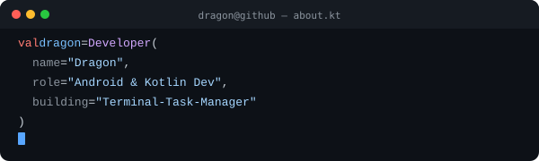

---

---

## Projects

| Project | Description | Status |
|---------|-------------|--------|
| [qr-code-studio](https://github.com/Dragons-Fox0058/qr-code-studio) | AI-powered QR scanner built with Google AI Studio | `Active` |

---

## Tech stack

---

## Stats

